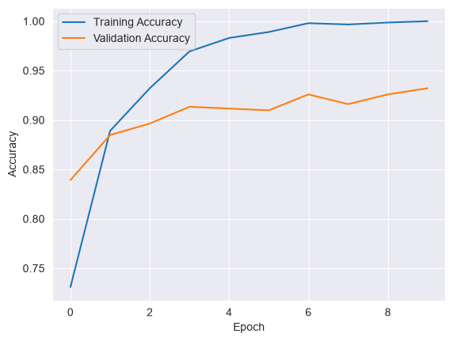
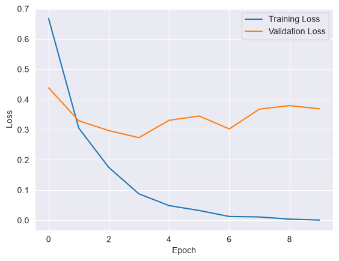
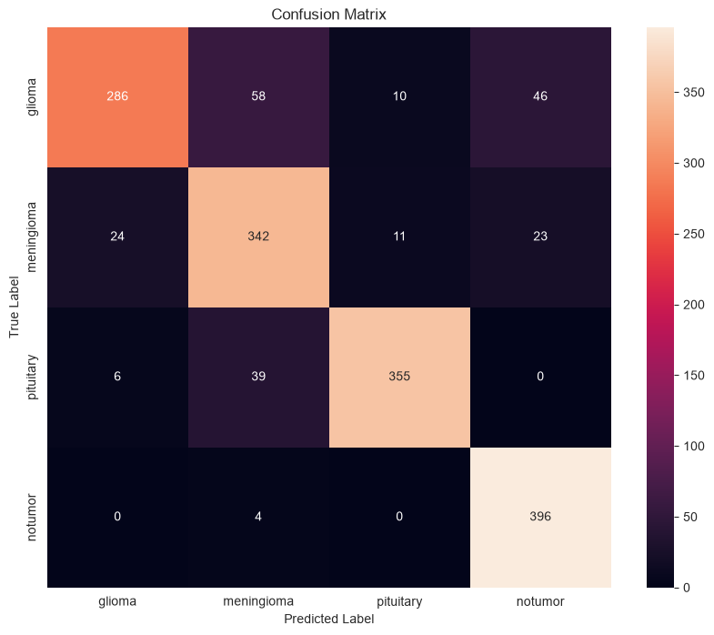

# 🧠 Brain Tumor Classification Using CNN

A Convolutional Neural Network (CNN) image classification project created as the **final project for the Machine Learning course at SLIPD Academy**, under the guidance of my mentor.

The model classifies brain scan images into four categories:

- Glioma
- Meningioma
- Pituitary Tumor
- No Tumor

> ⚠️ **Disclaimer:** This project is created for educational purposes. It is an image-classification experiment and is **not intended for medical diagnosis or clinical use**.

---

## 📌 Project Overview

The main objective of this project was to learn how Convolutional Neural Networks can be used for image classification.

The project demonstrates the complete workflow of a basic deep learning image-classification system:

**Image → Preprocessing → CNN → Classification → Evaluation**

The model was developed using **Python**, **TensorFlow**, **OpenCV**, **NumPy**, and **Scikit-learn**.

---

## 🛠️ Technologies Used

- Python
- TensorFlow / Keras
- OpenCV
- NumPy
- Matplotlib
- Seaborn
- Scikit-learn

---

## 📂 Dataset

The dataset contains brain scan images organized into four classes:

```text
data/
├── training/
│   ├── glioma/
│   ├── meningioma/
│   ├── pituitary/
│   └── notumor/
│
└── testing/
    ├── glioma/
    ├── meningioma/
    ├── pituitary/
    └── notumor/
```

The images are resized to:

```text
150 × 150 × 3
```

where `3` represents the RGB color channels.

---

## ⚙️ Image Preprocessing

The images are processed using OpenCV.

### 1. Load the image

```python
img = cv2.imread(img_path)
```

### 2. Convert BGR to RGB

```python
img = cv2.cvtColor(img, cv2.COLOR_BGR2RGB)
```

### 3. Resize the image

```python
img = cv2.resize(img, (150, 150))
```

### 4. Normalize pixel values

```python
img = img / 255.0
```

This converts pixel values from the range:

```text
0 - 255
```

to:

```text
0 - 1
```

which makes the images more suitable for neural network training.

---

## 🧠 CNN Architecture

The model uses convolutional and pooling layers to learn visual features from the images.

```text
Input (150 × 150 × 3)
        ↓
Conv2D (32 filters)
        ↓
MaxPooling2D
        ↓
Conv2D (64 filters)
        ↓
MaxPooling2D
        ↓
    Flatten
        ↓
Dense (32 neurons)
        ↓
Dense (4 neurons, Softmax)
```

### Why CNN?

Convolutional Neural Networks are well suited for image classification because they can automatically learn visual features such as:

- Edges
- Textures
- Shapes
- More complex visual patterns


## 🔧 Model Compilation

The model was compiled using the **Adam optimizer** and **Sparse Categorical Crossentropy** loss.

```python
model.compile(
    optimizer='adam',
    loss='sparse_categorical_crossentropy',
    metrics=['accuracy']
)
```

The final layer uses:

```python
Dense(4, activation='softmax')
```

because there are four possible classes.

---

## 🏋️ Training

The model was trained using:

```python
model.fit(
    x_train,
    y_train,
    epochs=10,
    batch_size=32,
    validation_data=(x_val, y_val)
)
```

The dataset was divided into training and validation data, with stratification used to maintain a balanced distribution of classes.

---

## 📊 Results

Final training results:

| Metric               | Result     |
| --------------------- | ---------- |
| Training Accuracy     | **100%** |
| Validation Accuracy   | **93.21%** |
| Test Accuracy         | **86.19%** |
| Validation Loss       | **0.3690** |
| Test Loss             | **1.712** |

The model was also evaluated using a **confusion matrix** to examine the classification performance of each individual class.

---

## 📈 Training Graphs

### Training vs Validation Accuracy



### Training vs Validation Loss



---

## 📊 Confusion Matrix



The confusion matrix helps visualize which classes were predicted correctly and which classes were confused with one another.

---

## 🔮 Individual Image Prediction

The project also contains a function that allows a single image to be classified using the trained model.

Example:

```python
result, confidence = predict_img(
    "data/testing/pituitary/Te-pi_3.jpg",
    model
)

print(result)
print(f"Confidence: {confidence:.2%}")
```

The model returns the predicted class and its corresponding model confidence score.

---

## 💾 Saving the Model

The trained model can be saved using:

```python
model.save("brain_tumor_classifier_final.h5")
```

This allows the trained model to be loaded and used later without training it again.

---

## 🚀 How to Run the Project

### 1. Clone the repository

```bash
git clone https://github.com/AkarshaWijekoon/brain-tumor-classification-cnn.git
```

### 2. Open the project

```bash
cd brain-tumor-classification-cnn
```

### 3. Install the required libraries

```bash
pip install tensorflow opencv-python numpy matplotlib seaborn scikit-learn
```

### 4. Make sure the dataset is placed in the correct directories

```text
data/training/
data/testing/
```

### 5. Run the Python script or Jupyter Notebook

The model will load the images, preprocess them, train the CNN, evaluate the model, and generate predictions.

---

## 📁 Project Structure

```text
brain-tumor-classification-cnn/
│
├── images/
│   ├── accuracy.png
│   ├── loss.png
│   └── confusion_matrix.png
│
├── model/
│   └── brain_tumor_classifier_final.h5
│
├── data.rar
├── model.ipynb
├── .gitattributes
└── README.md
```

---

## 🎓 About the Project

This project was created as the **final project for the Machine Learning course at SLIPD Academy**.

The project helped me gain practical experience with:

- Image preprocessing
- Convolutional Neural Networks
- Model training
- Validation and testing
- Overfitting and model improvement
- Confusion matrix analysis
- Image prediction
- Saving and using trained models

---

## 👨‍💻 Author

**Akarsha Wijekoon**

Machine Learning Student
SLIPD Academy

---

## 📜 License

This project is intended for educational purposes.
